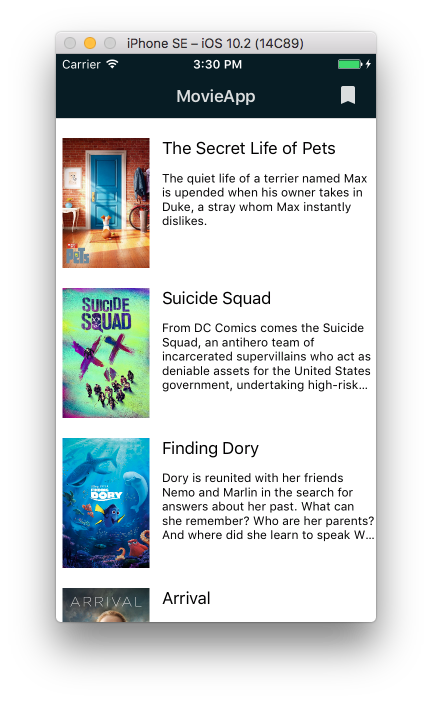
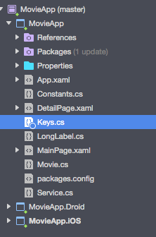

## MoviesApp Xamarin Forms
Sample app that I built to learn Xamarin Forms development. It lists the popular movies using TheMovieDb API and shows it details. 
 

## TODO
* Bookmark
* Search

## Build
* Register at [themoviedb.org](http://themoviedb.org) to get your API KEY V3
* Create a file `Keys.cs` on your multiplatform target and stores your KEY on an variable called API_KEY: `public static String API_KEY = "value";`

